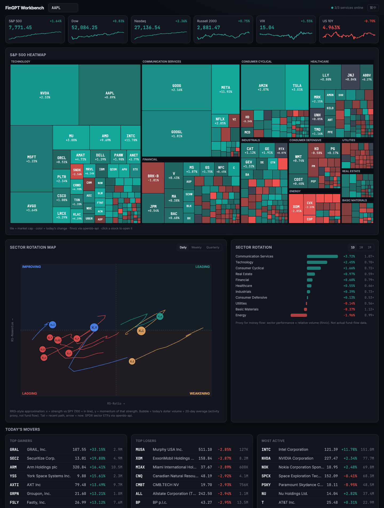
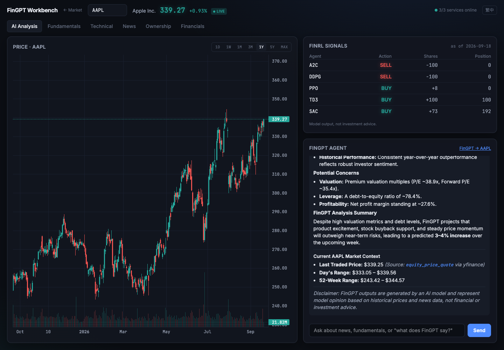
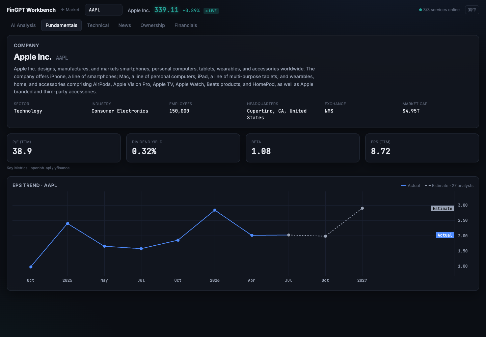
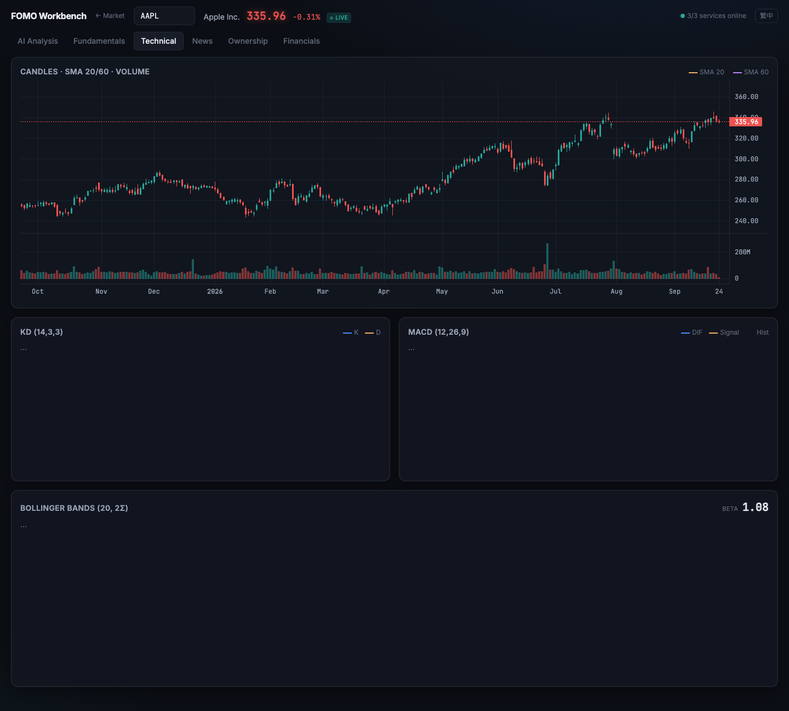
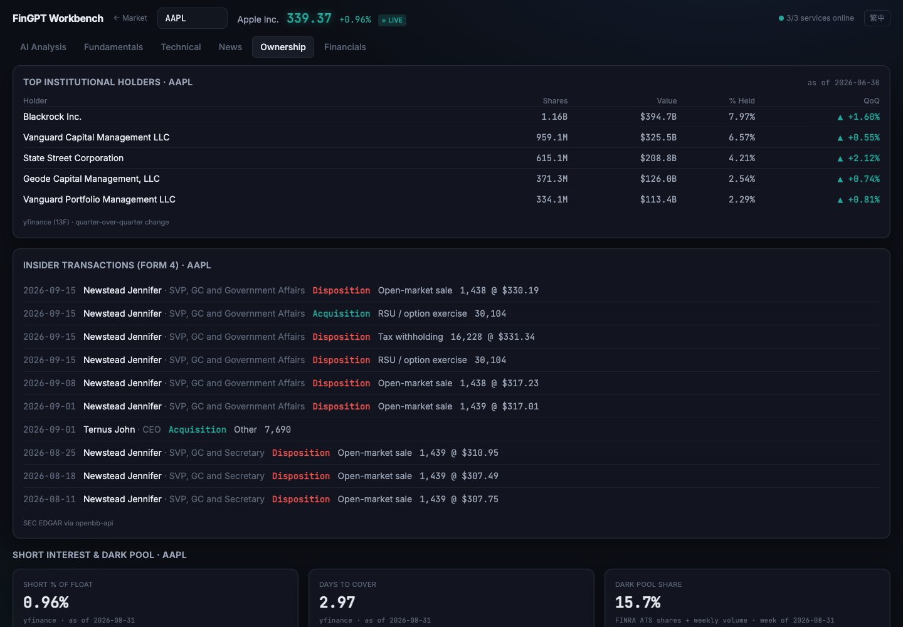
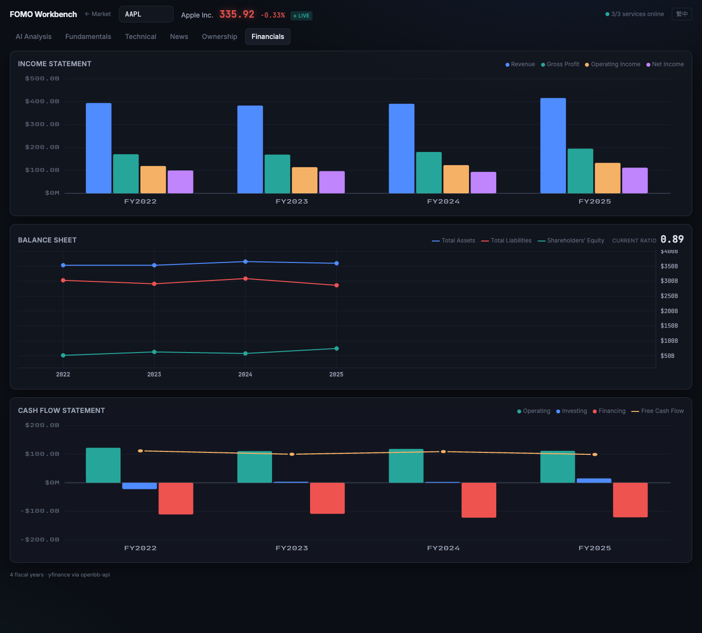

# OpenBB × AI4Finance Workbench

A local, single-page financial research dashboard that puts three things on one screen:
raw market data from **OpenBB**, quantitative trade signals from **FinRL** (deep RL agents),
and news-driven outlooks from **FinGPT-Forecaster** (a finance-tuned Llama-2-7B), tied together
by a small tool-calling agent. Everything except the agent's LLM runs on one Apple Silicon Mac.

Inspired by [God's Eye View](https://github.com/bilawalsidhu/gods-eye-view): take capabilities that
normally live in separate tools and integrate them into one cockpit — here for equity research.
Built as a pre-MSc FinTech portfolio project.

> Model output shown in the dashboard is a research aid, not investment advice.





## What it shows

**Market overview (landing page)** — index strip with intraday sparklines, S&P 500 treemap by
sector/market cap/daily change, sector rotation bars, an RRG-style sector bubble map
(SPDR sector ETFs vs SPY), and top gainers/losers/most active. Click any tile to open a stock.

**Daily brief (top of the landing page)** — after each US close the agent runs FinRL and FinGPT
over a watchlist you edit in place, then Gemini writes a short overview of where the two engines
agree and conflict. Stored locally as one JSON per session; catches up on start if the Mac was off.

**Per-stock view, six tabs** —

| Tab | Content |
|---|---|
| AI analysis | Candlestick chart (1D…MAX, live during the session) · FinRL signals from five DRL agents · chat with an agent that can query OpenBB and run FinGPT |
| Fundamentals | Company profile · P/E, dividend yield, beta, EPS TTM · quarterly EPS actual vs. estimate with next-two-quarter consensus |
| Technical | Candles + SMA20/60 + volume · Stochastic KD and MACD · Bollinger bands + beta |
| News | Company headlines (title/link only) · SEC 8-K filings with item codes |
| Ownership | Top institutional holders (13F) · insider Form 4 transactions · short interest, days to cover, dark-pool share |
| Financials | Income statement, balance sheet trend + current ratio, cash-flow bars + free cash flow (4 fiscal years) |

Dark, exchange-style UI (React + Tailwind + TradingView Lightweight Charts), English / 繁體中文.

<details><summary>More screenshots</summary>

| Fundamentals | Technical |
|---|---|
|  |  |

| Ownership | Financials |
|---|---|
|  |  |

</details>

## Architecture

```
                 ┌──────────────────────────── browser ────────────────────────────┐
                 │  ui/ (React + Vite, built to static files)                       │
                 └───────┬───────────────────────┬───────────────────────┬─────────┘
                         │                       │                       │
              :6900      ▼            :8001      ▼            :8010      ▼
        ┌──────────────────────┐  ┌─────────────────────┐  ┌──────────────────────┐
        │ openbb-api           │  │ openbb-backend/     │  │ agent/               │
        │ OpenBB Platform REST │◄─┤ FastAPI             │  │ FastAPI + Gemini     │
        │ (yfinance, SEC,      │  │ · FinRL signals     │  │ tool-calling loop    │
        │  FINRA, finviz…)     │◄─┼─· EPS trend, 13F   │  │ · 5 OpenBB tools via │
        │                      │  │ · Yahoo tick → SSE  │  │   openbb-mcp (:8005) │
        │                      │  │ · serves ui/dist    │  │ · fingpt_forecast    │
        └──────────────────────┘  └─────────────────────┘  │   (Llama-2-7B+LoRA,  │
                                                           │    on MPS, ~1 min)   │
                                                           └──────────────────────┘
```

- **Data layer — OpenBB Platform** (`openbb-api`). Every widget goes through it unless it lacks a
  free provider for that item (EPS history/estimates, 13F holders, real-time ticks) — those three
  use the `yfinance` package directly inside `openbb-backend/widgets/`, one file each.
- **Signal layer — FinRL.** Five agents (A2C/DDPG/PPO/TD3/SAC) trained jointly on a basket of 30
  stocks. The endpoint rebuilds the exact upstream feature pipeline and environment from OpenBB
  data, replays the last 60 sessions, and reports each agent's intent for today, its simulated
  position and the basket portfolio's 60-session curve. Three baskets are trained, so a stock in
  more than one gets several independent readings — see *A small experiment* below.
- **Insight layer — FinGPT-Forecaster.** The upstream prompt format fed with OpenBB profile,
  prices, news and fundamentals; returns `[Positive Developments] / [Potential Concerns] /
  [Prediction & Analysis]`. Runs locally in fp16 on the Mac's GPU (~6 tok/s).
- **Agent.** ~150 lines of loop plus the daily-brief scheduler, no framework: Gemini function-calling over five `openbb-mcp` tools
  plus `fingpt_forecast` and `finrl_signal`, streamed to the UI as SSE — so one question can
  cite both engines and point out where they disagree. The only cloud dependency in the project.
- **UI.** One component per card; tabs stay mounted so charts and chat survive switching.

### A small experiment: three model baskets

A deep-RL agent here decides across a whole basket at once, so it only knows the stocks it was
trained on. Rather than retraining once and losing the baseline, the project keeps three sets and
lets you switch between them on the signal panel:

| Basket | Constituents | Training window |
|---|---|---|
| `DOW 30 · 2014` | DOW 30 | 2014-01 – 2025-12 (the original Phase 2 models) |
| `DOW 30 · 2019` | DOW 30 | 2019-07 – 2025-12 |
| `Tech 30 · 2019` | tech-weighted 30 | 2019-07 – 2025-12 |

The middle one exists so the comparison is attributable: `Tech 30 · 2019` vs `DOW 30 · 2019`
isolates the constituents, `DOW 30 · 2014` vs `DOW 30 · 2019` isolates the training period. Seven
tickers are in both baskets (AAPL, AMZN, CRM, CSCO, IBM, MSFT, NVDA) and are the directly
comparable samples.

The window starts in 2019-07 because CRWD, the shortest history in the tech basket, IPO'd in
2019-06 — and because of a trap worth naming: upstream's `FeatureEngineer.clean_data` pivots
closes and calls `dropna(axis=1)`, so **any member that does not span the whole window is silently
dropped from the basket**. Training the tech basket from 2014 yields a 28-stock model that reports
no error and simply never mentions CRWD or UBER. `training/train_basket.py` turns that into a hard
failure instead.

All three sets use the upstream defaults — 20,000 timesteps, one seed, one run, no validation
split — so differences between baskets describe *these training runs*, not tech vs. blue-chip
investing. The UI says so on the panel.

### Decisions worth knowing

- **Upstream projects are dependencies, not forks.** OpenBB, FinRL and FinGPT are installed
  or cloned unmodified; all glue lives in `openbb-backend/`, `agent/` and `ui/` (~2.5k lines).
  Upgrading is `pip install --upgrade` / `git pull`, and versions are pinned in `requirements/`.
- **Own dashboard instead of OpenBB Workspace.** OpenBB Inc. announced its wind-down in
  August 2026 and Workspace registration is closed; the open-source data platform is unaffected.
  The dashboard calls the REST API directly, so nothing depends on Workspace's future.
- **Three Python environments.** FinRL, FinGPT (torch 2.14 / transformers 5) and OpenBB have
  incompatible pins; each service runs in its own `uv` venv (`envs/{openbb,finrl,fingpt}`).
- **`openbb-api` runs with 3 uvicorn workers** because the finviz provider blocks the event
  loop for ~10 s on the S&P 500 screener; a single worker would stall every other panel.
- **Complete sessions only.** During US trading hours yfinance returns an in-progress daily bar;
  FinRL and FinGPT inputs are cut at the last closed session (16:00 ET) so indicators are never
  computed on half a bar.

### Honest limitations

- FinRL agents only know the 30 stocks in their basket; a ticker in none of the three gets a 404
  on that panel. FinGPT still answers for it, though it is fine-tuned on the DOW 30.
- FinGPT is fine-tuned on the DOW 30 too, samples stochastically, and takes 60–90 s per call.
- Free data: daily/delayed for most panels; the tick stream uses Yahoo's unofficial WebSocket
  and silently falls back to 60 s polling if it breaks. FINRA dark-pool data lags ~2 weeks.
- The sector RRG is a public approximation of the proprietary JdK calculation.
- Sector "rotation" bars are a performance proxy, not fund-flow data.

## Running it

Prerequisites: macOS on Apple Silicon (24 GB unified memory is enough), Python 3.12 via `uv`,
Node 20+, ~30 GB disk (models + environments), a Gemini API key.

```bash
# 1. Environments: exact freezes, so --no-deps (the `-e` lines point at this machine's upstream clones; step 2 replaces them)
for e in openbb finrl fingpt; do uv venv envs/$e --python 3.12 && grep -v '^-e' requirements/$e.lock.txt | uv pip install --no-deps --python envs/$e/bin/python -r /dev/stdin; done

# 2. Upstream engines (not vendored; --no-deps again, otherwise FinRL's setup.py downgrades yfinance)
git clone https://github.com/AI4Finance-Foundation/FinRL.git  && git -C FinRL  checkout 2334a5f && uv pip install --no-deps --python envs/finrl/bin/python  -e FinRL
git clone https://github.com/AI4Finance-Foundation/FinGPT.git && git -C FinGPT checkout cefb3a2 && uv pip install --no-deps --python envs/fingpt/bin/python -e FinGPT

# 3. Train the FinRL agents (CPU, ~10 min; writes finrl-work/trained_models/)
mkdir -p finrl-work && cd finrl-work
../envs/finrl/bin/python ../FinRL/examples/FinRL_StockTrading_2026_1_data.py
../envs/finrl/bin/python ../FinRL/examples/FinRL_StockTrading_2026_2_train.py
cd ..

# 4. FinGPT weights download on first use from Hugging Face (NousResearch/Llama-2-7b-chat-hf
#    + FinGPT/fingpt-forecaster_dow30_llama2-7b_lora, ~13 GB). Optional: export PYTORCH_ENABLE_MPS_FALLBACK=1

# 5. Agent key
echo 'GEMINI_API_KEY=...' > agent/.env

# 6. UI
cd ui && npm install && npm run build && cd ..
```

Start the four services (or register them in the OpenBB ODP Desktop app, which is how this
project is run day to day):

```bash
envs/openbb/bin/uvicorn openbb_platform_api.main:app --host 127.0.0.1 --port 6900 --workers 3
envs/openbb/bin/openbb-mcp --transport streamable-http --host 127.0.0.1 --port 8005 --allowed-categories equity,news,index --default-categories equity,news,index
envs/finrl/bin/uvicorn  main:app --port 8001 --app-dir openbb-backend
envs/fingpt/bin/uvicorn main:app --port 8010 --app-dir agent
```

Open <http://localhost:8001>. For UI development, `cd ui && npm run dev` serves on :5173 against
the same backends. `.claude/launch.json` holds the same commands for Claude Code sessions.

## Tests

The glue layer's pure logic has unit tests (no services or network needed): tick folding into
bars, the squarified treemap, the RRG approximation, the FINRA reporting-week mapping, the Gemini
schema conversion and the last-complete-session rule.

```bash
cd ui && npx vitest run
cd agent && ../envs/fingpt/bin/python -m pytest
cd openbb-backend && ../envs/finrl/bin/python -m pytest   # imports the trained agents from finrl-work/
```

## Repository layout

```
openbb-backend/   FastAPI: finrl_signal, eps_trend, institutional, live_quote; baskets.json; serves ui/dist; tests/
training/         train_basket.py — trains one basket's five agents from baskets.json
agent/            FastAPI + Gemini loop; brief.py (daily brief + scheduler); tools/{fingpt,finrl}_tool.py; tests/
ui/               React + Vite + Tailwind; src/components/{market,fundamentals,technical,news,ownership,financials}; *.test.ts beside the code
requirements/     pip freeze of each venv (openbb / finrl / fingpt)
fingpt-smoke/     standalone FinGPT inference check used before wiring the agent
CLAUDE.md         project brief and phase-by-phase engineering log (繁體中文)
FinRL/ FinGPT/ envs/ finrl-work/   git-ignored: upstream clones, venvs, trained models
```

## Versions

OpenBB 4.7.2 · FinRL `2334a5f` (2026-07) · FinGPT `cefb3a2` (2026-09) · stable-baselines3 2.9 ·
torch 2.14 / transformers 5.17 / peft 0.21 · yfinance 0.2.66 (pinned: 1.x breaks FinRL's downloader) ·
React 19 / Vite 8 / Lightweight Charts 5.

## License

The code in this repository — `openbb-backend/`, `agent/`, `ui/`, `training/` — is MIT licensed
(see `LICENSE`). Nothing from upstream is vendored here: FinRL and FinGPT (both MIT) are cloned
separately as dependencies, and the OpenBB Platform is never imported at all — every call to it
goes over HTTP to a local `openbb-api`.

That last point matters for OpenBB's AGPL-3.0 licensing: it covers the platform you run locally,
not this client. Deploying the whole stack as a public network service is a different question, so
check the upstream `LICENSE` (OpenBB has announced a move to a permissive license) before doing
that. Running it locally, as documented above, is not affected.
